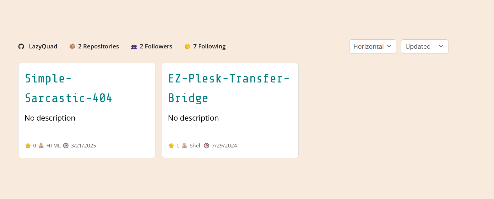

# WP GitHub Portfolio

Display your GitHub repositories beautifully on your WordPress site using a shortcode. Supports multiple layouts, sorting, pinned repositories, and a sleek, modern design with AJAX functionality.



---

## 🔧 Features

- 💠 Vertical, horizontal, or list layout options
- 🔁 Sort by stars, name, or recently updated
- 📌 Supports pinned repositories
- ⚡ Live updates via AJAX — no page reloads
- 🎛 Easy dropdown controls for layout and sort
- 🎨 Responsive card design
- ⚙️ Shortcode-based usage

---

## 📦 Installation

1. Download the latest release from the [Releases](https://github.com/LazyQuad/wp-github-portfolio/releases) page.
2. Upload the ZIP via the **Plugins > Add New > Upload Plugin** section in your WordPress dashboard.
3. Activate the plugin.

---

## 🧪 Usage

### 📋 Shortcode

Place this anywhere in a post, page, or widget:

```php
[github_projects user="YourGitHubUsername"]
```

### 🔧 Available Shortcode Attributes

| Attribute  | Description | Default |
|------------|-------------|---------|
| `user`     | GitHub username to display repos from | *(required)* |
| `limit`    | Max number of repositories to show | `10` |
| `mode`     | `vertical`, `horizontal`, or `list` layout | `vertical` |
| `sort`     | `updated`, `stars`, or `name` | `updated` |
| `pinned`   | Comma-separated list of pinned repo names | `""` |

---

## 🖼 Example

```php
[github_projects user="LazyQuad" limit="6" mode="horizontal" sort="stars" pinned="plugin-one,plugin-two"]
```

---

## 📁 Assets

Place your custom GitHub icons in `assets/` if you want to style them.

---

## 🧠 Credits

Built by [Deryll Newman (LazyQuad)](https://lazyquad.com)  
Design inspired by [2KAbhishek](https://github.com/2kabhishek/projects)   
Code collaboration and documentation by [ChatGPT, OpenAI](https://openai.com/chatgpt) 

---

## 🛠 License

MIT — use it, hack it, share it.
